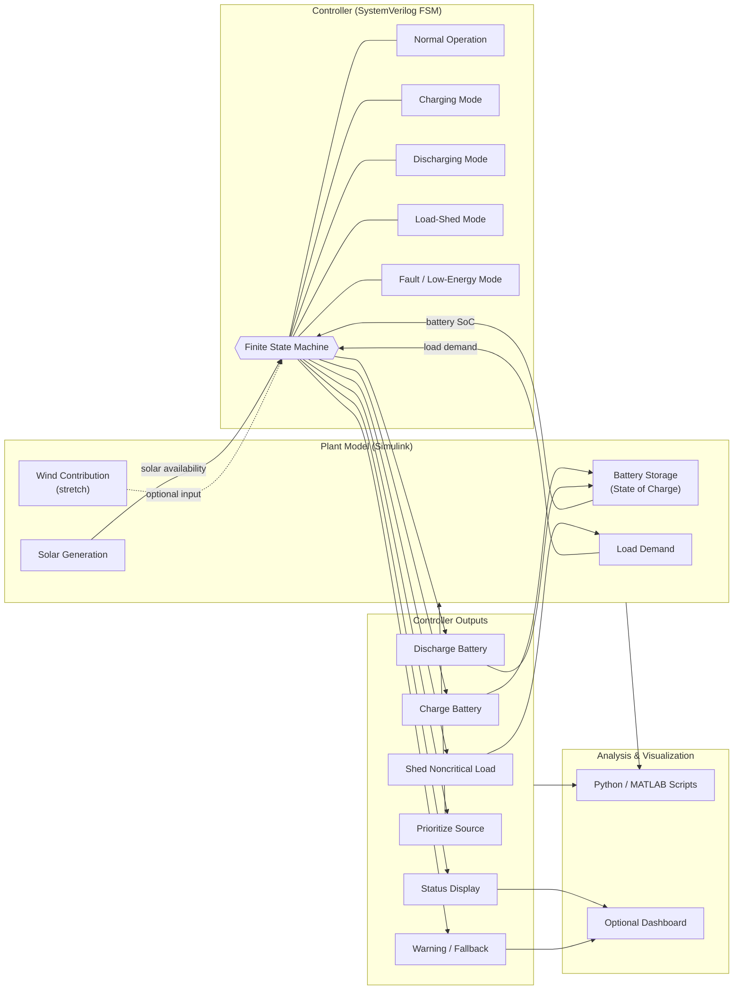

# **1\. PROJECT SUMMARY**

This project will build a **smart energy optimizer for a simulated microgrid or event venue** that decides how to allocate power from available sources and manage loads in real time. The system will use **Simulink as the plant model** and **SystemVerilog as the controller**, letting me study both system-level behavior and hardware-style decision logic. The main goal is to optimize sustainability and reliability by prioritizing available clean energy, managing battery state, and shedding noncritical loads when needed.\[[opal-rt](https://www.opal-rt.com/blog/the-case-for-hardware%E2%80%91in%E2%80%91the%E2%80%91loop-testing-in-microgrid-development/)\]

# **2\. PROBLEM STATEMENT**

Large events and microgrids face changing energy supply and demand, especially when renewable sources fluctuate and loads vary over time. A controller must decide, quickly and reliably, whether to charge batteries, discharge batteries, prioritize a power source, or reduce load demand. This project addresses that challenge with a compact decision system that can be tested in simulation before any physical deployment.\[[sciencedirect](https://www.sciencedirect.com/science/article/pii/S0378779620305605)\]

# **3\. PROJECT SCOPE**

The scope is intentionally focused so it stays realistic and strong. The core system will model a **smart energy optimizer** for a simulated microgrid or event venue, not a full utility-scale grid. The initial version will include solar, battery storage, and load demand; wind can be added as a next step, while hydro, biomass, ocean, geothermal, and other sources remain stretch goals for future expansion.

# **4\. CORE INPUTS**

The controller will use the following main inputs:

* Solar availability  
* Battery state of charge  
* Load demand.

Optional stretch inputs can include:

* Wind contribution.  
* Hydro contribution.  
* Biomass contribution.  
* Ocean energy contribution.  
* Geothermal contribution.

These inputs let the controller make realistic source-allocation decisions under changing conditions, which is exactly the kind of problem microgrid controller testbeds are built to study.\[[docs.nlr](https://docs.nlr.gov/docs/fy24osti/89074.pdf)\]

# **5\. CONTROLLER OUTPUTS**

The controller will produce a set of simple but meaningful outputs that represent system action:

* Charge battery.  
* Discharge battery.  
* Shed noncritical load.  
* Prioritize a specific source.  
* Send status to display.  
* Trigger warning or fallback mode.

These make the controller easy to understand, but rich to demonstrate embedded-style decision making.\[[nrel](https://www.nrel.gov/docs/fy20osti/71338.pdf)\]

# **6\. SYSTEM ARCHITECTURE**

The project will be divided into two major parts:

## ***Plant Model***

The plant will live in **Simulink** and represent the energy world the controller is responding to. It will simulate changing solar generation, battery behavior, and load demand, and it can later be extended to include wind or other renewable sources. This is the part that behaves like the physical system.\[[mathworks](https://www.mathworks.com/help/simulink/getting-started-with-simulink.html)\]

## ***Controller***

The controller will be written in **SystemVerilog** and will act like the embedded logic that reads inputs and issues decisions. A finite state machine or rule-based controller is a good fit because it is clear, testable, and easy to expand. This is the part that behaves like the “brain” of the system.\[[mathworks](https://www.mathworks.com/discovery/systemverilog.html)\]

## ***System Diagram***

This view ties together the plant model, the FSM-based controller, its resulting outputs, and the optional analysis/dashboard layer, showing how sensor-style inputs flow in and decision outputs flow back out to the simulated microgrid.

# **7\. IMPLEMENTATION STACK**

The stack should stay simple at first:

* **Simulink** for the plant model.  
* **SystemVerilog** for the controller logic.  
* Optional Python or MATLAB scripts for plotting and scenario analysis.  
* Optional dashboard for visual output.

This stack gives a realistic hardware/software split that matches controller-in-the-loop workflows used in microgrid development.\[[opal-rt](https://www.opal-rt.com/blog/the-case-for-hardware%E2%80%91in%E2%80%91the%E2%80%91loop-testing-in-microgrid-development/)\]

# **8\. CONTROL LOGIC**

A good first controller design is a **finite state machine** with states such as:

* Normal operation.  
* Charging mode.  
* Discharging mode.  
* Load-shed mode.  
* Fault or low-energy mode.

The controller can examine battery state, solar availability, and load demand, then move between these states according to predefined thresholds. This keeps the behavior understandable and makes it easier to debug than a more complex optimization algorithm at the start.\[[studylib](https://studylib.net/doc/27833437/1-fsm-in-systemverilog)\]

# **9\. SIMULATION SCENARIOS**

To prove the idea, the system should be tested under several scenarios:

1. High solar, low load.  
2. Low solar, high load.  
3. Battery nearly full.  
4. Battery nearly empty.  
5. Rapidly changing demand.  
6. Extended low-generation period.

These test cases mirror the kind of scenario-based validation used in microgrid controller evaluation. They also give you strong graphs and charts for a final presentation.\[[docs.nlr](https://docs.nlr.gov/docs/fy24osti/89074.pdf)\]

# **10\. STRETCH GOALS**

Once the core system works,the system can be made more advanced by adding:

* Wind input as a second renewable source.  
* More energy sources like hydro or geothermal.  
* Better decision logic using scoring or optimization.  
* Priority tiers for critical vs noncritical loads.  
* A more detailed venue model for a World Cup site or event district.

These stretch goals make the project more impressive without risking the core scope.

# **12\. SUCCESS CRITERIA**

The project is successful if the controller can:

* Keep power available to critical loads.  
* Increase renewable usage when possible.  
* Protect the battery from unsafe states.  
* Reduce unnecessary load when supply is limited.  
* Respond consistently across multiple scenarios.

That gives measurable outcomes instead of just a concept. It also makes the project easier to present as an engineering system rather than an idea.