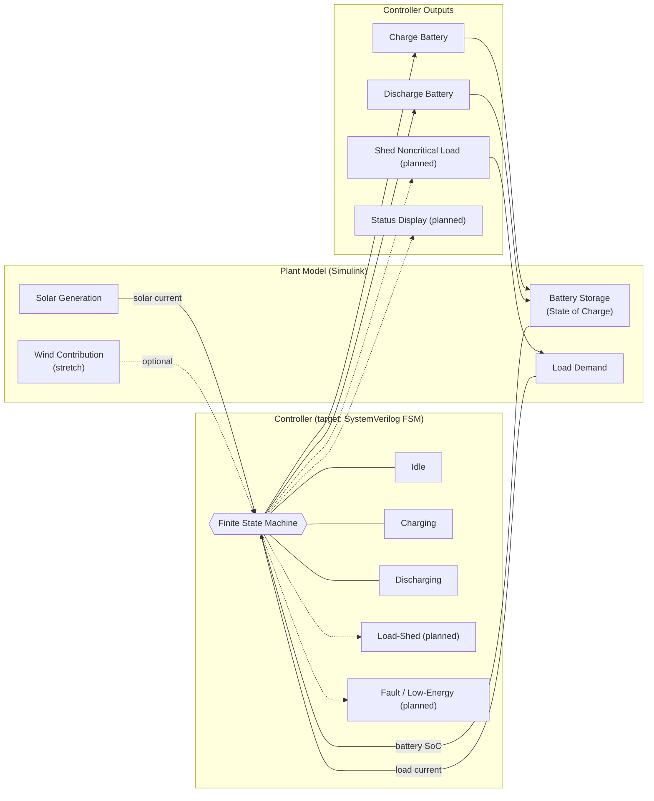

# ⚡ Smart Energy Optimizer

[](https://www.mathworks.com/products/simulink.html)
[](https://www.mathworks.com/discovery/systemverilog.html)
[](https://github.com/Kami1230/Smart-Energy-Optimzer)
[](./LICENSE)

A simulation-driven **microgrid energy management controller** that makes real-time decisions for battery charge/discharge based on solar generation and load demand — built as a stepping stone toward a full hardware-style FSM controller (SystemVerilog RTL) and an Arduino embedded implementation.

Originally started as a small-scale H-Darrieus VAWT (adaptive-blade wind turbine) science fair project; pivoted to this software/simulation-based microgrid optimizer to keep the core control-systems learning goals intact without needing to rebuild the physical prototype.

---

## 🚦 Current Status

This project is under active development. Here's what's actually working today vs. what's planned:

| Component | Status |
|---|---|
| Simulink plant model (PV + battery + variable load) | ✅ Built & validated |
| Plant validation (steady-state, load-step, solar-step tests) | ✅ Passing |
| Rule-based charge/discharge controller (Simulink) | ✅ Working, stable |
| Hysteresis + slew-rate limiting (anti-chatter tuning) | ✅ Implemented |
| Stateflow reimplementation of controller | 🔜 In Progress |
| Arduino C/C++ controller port | 🔜 Not started |
| SystemVerilog FSM controller | 🔜 In Progress |
| Load-shedding / priority-tier logic | 🔜 Planned (not in current controller) |
| Wind as second generation source | 🔜 Stretch goal |

**In short:** the plant model and a basic 3-state (idle / charge / discharge) rule-based controller are done and validated in Simulink. Everything past that — Stateflow, Arduino, SystemVerilog, load-shedding, multi-source support — is roadmap, not yet built.

---

## 🧠 What's built so far

### Plant model (Simulink/Simscape)
- **PV source**: Simscape Solar Cell block, configured as a 9-cell series string (single-cell Voc of 0.6V was too low to source current into the bus voltage — moving to a series string fixed this)
- **Battery**: Simscape Table-Based Battery (27 A·hr, initial SoC 0.5), in series with a small resistor to keep the model well-posed for the solver
- **Variable load**: Controlled Current Source driven by a step input
- **Instrumentation**: current sensors on all three branches (Ipv, Iload, IBattery) plus a bus voltage sensor, all tagged and scoped

### Validation performed
1. Steady-state check (flat inputs, confirm no errors, sane values)
2. Load-only step response (1A → 3A)
3. Solar-only step response (100% → 30% availability)
4. Combined scenario (both steps active)

Along the way this surfaced and fixed several real bugs worth noting for anyone building similar models: a ground short that pinned the bus at 0V, an algebraic loop from three zero-impedance sources sharing a node, a current sensor wired in shunt instead of series, a PV branch return path that looped back to the same rail instead of ground, and reversed polarity on the load current source.

### Controller (Simulink, rule-based)
Simple 3-mode logic:
- **Charge** when `Ipv − Iload > threshold` AND `SoC < 0.9`
- **Discharge** when `Ipv − Iload < −threshold` AND `SoC > 0.1`
- **Idle** otherwise

Implemented with Relational/Logical Operator blocks feeding a Switch, with a hysteresis dead-band (±2A) and a Rate Limiter on the output to prevent bang-bang chattering between charge/discharge states.

---

## 🎯 Target Architecture (Planned)

The current Simulink controller is a functional prototype. The plan is to reimplement the same control logic twice more — once as a Stateflow chart / SystemVerilog FSM (for RTL/hardware), and once in Arduino C/C++ (for a physical microcontroller demo) — validating each against the same plant model and test scenarios.



Dashed lines = not yet implemented.

---

## 📦 Repository Structure

> Reflects what's actually in the repo today — sections will grow as each stage is built.

```text
Smart-Energy-Optimzer/
├── README.md
├── simulink/
│   └── SmartEnergyOptimizer.slx      # plant model + rule-based controller
└── docs/                              # (planned) design notes, scenario writeups
```

Planned additions as the project progresses: `rtl/` (SystemVerilog FSM + package), `tb/` (testbench), `arduino/` (embedded controller port), `scripts/` (batch scenario runner + analysis).

---

## ⚙️ Quick Start

### 1) Clone the repository

```bash
git clone https://github.com/Kami1230/Smart-Energy-Optimzer.git
cd Smart-Energy-Optimzer
```

### 2) Open and run the plant model

1. Open MATLAB
2. Navigate to `simulink/`
3. Open `SmartEnergyOptimizer.slx`
4. Run with `Load_Demand_Step`, `Irradiance_max`, and the controller's dead-band constants as documented below
5. Inspect the `Ipv`, `Iload`, `IBattery`, `V_bus`, and `Battery SOC` scopes

### Key parameters (for reproducing the validated checkpoint)

| Parameter | Value |
|---|---|
| PV series cells | 9 |
| PV short-circuit current (Isc) | 7.34 A |
| Battery capacity | 27 A·hr |
| Battery initial SoC | 0.5 |
| Series resistor (battery branch) | 0.05 Ω |
| Controller charge/discharge threshold | ±2 A (Surplus) |
| Controller SoC bounds | 0.1 – 0.9 |
| Rate Limiter slew rate | ±1 A/s |

---

## 🧪 Validation Scenarios (current)

1. Steady-state (flat load, flat solar) — confirms no errors, sane bus voltage
2. Load step (1A → 3A) — confirms battery/PV branches respond correctly
3. Solar step (100% → 30% availability) — confirms PV output tracks irradiance
4. Combined step scenario — both changes active in one run
5. Controller charge/discharge validation — confirms Charge_Enable / Discharge_Enable fire correctly and IBattery tracks the Ipv−Iload residual (not just mirroring one branch)

Planned (once Stateflow/Arduino/SystemVerilog versions exist): the six-scenario suite from the original design (battery nearly full/empty, rapidly changing demand, extended low-generation period) will be used to cross-validate all implementations against each other.

---

## 🛣️ Roadmap

- [x] Build and validate Simulink plant model
- [x] Build rule-based controller with hysteresis + slew limiting
- [ ] Rebuild controller logic as a Stateflow chart
- [ ] Port controller logic to Arduino C/C++
- [ ] Implement SystemVerilog FSM + testbench
- [ ] Cross-validate all three controller implementations against the same plant model
- [ ] Add load-shedding / priority-tier logic
- [ ] Add wind as a second renewable source
- [ ] Build a results dashboard

---

## 🙌 Acknowledgments

Inspired by controller-in-the-loop and microgrid simulation workflows used in modern power systems R&D. Originally scoped as a physical VAWT prototype for a science fair; pivoted to this simulation-first approach.
